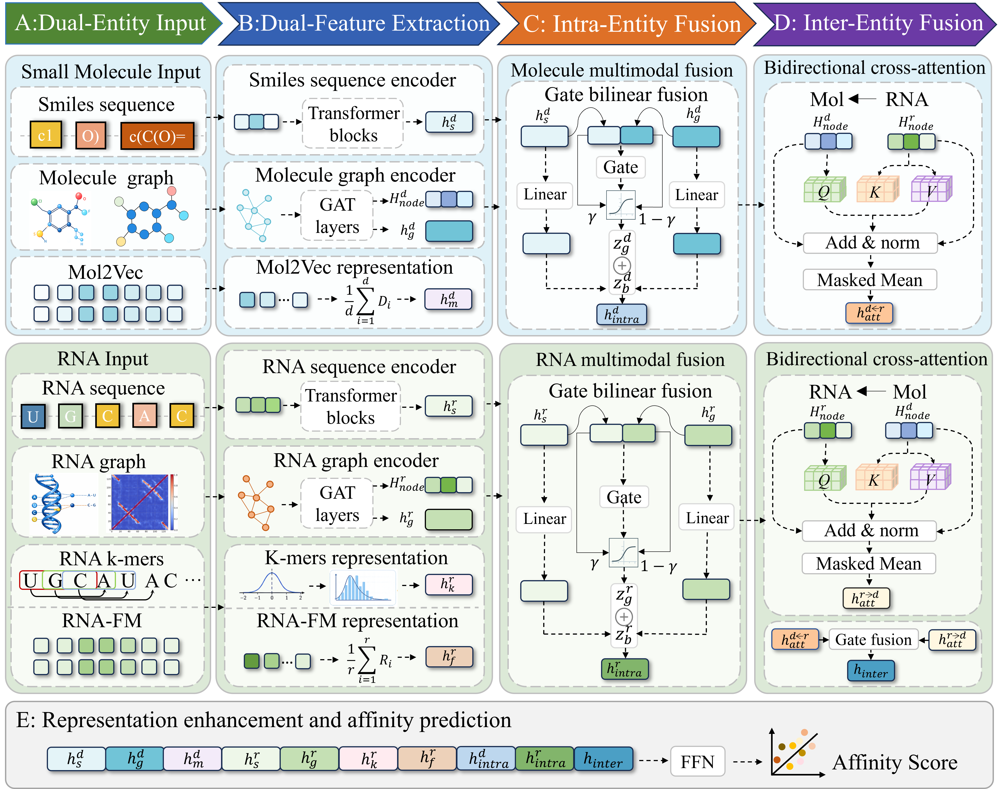

# 🌿 HERBA

## **HERBA: Hierarchical Entity Fusion with Bidirectional Cross-Attention for RNA–Small Molecule Binding Affinity Prediction**

**Authors:** Yahan Li, Zhijiang Huang, Ziyu Fan, Song Chen, Yucheng Wang, Yaw Sing Tan, Min Wu, and Lei Deng

## 🔬 Overview

**HERBA** is a deep learning framework for **RNA–small molecule binding affinity prediction**. It integrates heterogeneous representations of RNAs and small molecules through hierarchical entity fusion and bidirectional cross-attention, enabling effective modeling of both entity-specific information and cross-entity interactions.

## 🧠 HERBA Framework

<p align="center">
  
</p>

<p align="center"><b>Overview of the HERBA framework.</b></p>

## ⚙️ Environment

We recommend creating the HERBA environment directly from the provided `environment.yml`:

```bash
conda env create -f environment.yml
conda activate HERBA
```

### 📦 Main Dependencies

```text
Python              3.10
PyTorch             2.3.0
PyTorch Geometric   2.5.3
NumPy               1.26.4
pandas              1.5.3
SciPy               1.11.4
scikit-learn        1.7.2
RDKit               2022.9.5
Biopython           1.85
```

If the complete environment cannot be installed directly, create a Python 3.10 environment first and manually install the packages above.

> 🚀 The released checkpoints can be directly evaluated without regenerating pretrained features or data partitions.

## ⚡ Quick Start

If you only want to reproduce the results of a released HERBA model:

```bash
python test.py --task regression_cv5
```

The released checkpoints and corresponding cached test datasets are already provided under `Checkpoint/`. Therefore, **no data splitting, pretrained feature generation, or model retraining is required for direct testing**.

## 📁 Repository Structure

The main structure of the released repository is:

```text
HERBA/
├── Checkpoint/
│   ├── regression_cv5/
│   ├── regression_cv10/
│   ├── classification_cv5/
│   ├── classification_cv10/
│   ├── blind_RNA/
│   ├── blind_small_molecule/
│   ├── blind_double/
│   ├── rna_similarity_30/
│   └── molecular_scaffold/
├── data/                         # Main processed R-SIM data and features
├── models/                       # HERBA model definitions
├── RSM_data/                     # RNA subtype and independent datasets
├── regression_cv.py              # Regression cross-validation
├── classification_cv.py          # Classification cross-validation
├── regression_blind_cold.py      # RNA/drug/dual cold-start experiments
├── regression_strict_cold.py     # Sequence-similarity/scaffold experiments
├── test.py                       # Evaluate released HERBA checkpoints
├── create_data_fold.py           # Data construction utilities
├── kmer.py                       # RNA sequence feature utilities
├── utils.py                      # Common utilities
├── environment.yml               # Conda environment
└── README.md
```

Each directory under `Checkpoint/` contains the trained HERBA models and corresponding cached test partitions. A typical task directory is organized as:

```text
Checkpoint/regression_cv5/
├── HERBA_f0.pt
├── HERBA_f1.pt
├── HERBA_f2.pt
├── HERBA_f3.pt
├── HERBA_f4.pt
└── dataset_cache/
    ├── f0_test.data
    ├── f1_test.data
    ├── f2_test.data
    ├── f3_test.data
    └── f4_test.data
```

> ⚠️ **Important:** Each trained checkpoint should always be evaluated together with the corresponding cached test set from the same experimental setting and fold.

## 🗂️ Data

### 🧬 Main R-SIM Dataset

The main processed data and features used by HERBA are stored under:

```text
data/
├── drug_embeddings.csv
└── RNA/
    ├── ligand.json
    ├── rna.json
    ├── Y
    ├── aln/
    ├── pconsc4/
    ├── rnafm/
    └── ...
```

These files contain the processed RNA–small molecule pairs and the features required by HERBA.

### 🧫 RNA Subtype and Independent Test Datasets

The RNA subtype datasets and independent test dataset are provided under:

```text
RSM_data/
├── All_sf_dataset_v1.csv
├── Aptamers_dataset_v1.csv
├── miRNA_dataset_v1.csv
├── Repeats_dataset_v1.csv
├── Ribosomal_dataset_v1.csv
├── Riboswitch_dataset_v1.csv
├── Viral_RNA_dataset_v1.csv
└── Viral_RNA_independent_dataset_v1.csv
```

The subtype datasets cover six RNA categories: **aptamers, miRNAs, repeats, ribosomal RNAs, riboswitches, and viral RNAs**. `All_sf_dataset_v1.csv` contains the combined RNA subtype dataset, while `Viral_RNA_independent_dataset_v1.csv` is used for independent evaluation.

## 🛠️ External Feature Generation Tools

HERBA uses pretrained and structure-derived representations generated by the following external tools:

- 🧬 **SPOT-RNA-2D** — RNA structural/contact features: https://github.com/jaswindersingh2/SPOT-RNA-2D
- 🧠 **RNA-FM** — pretrained RNA sequence representations: https://github.com/ml4bio/RNA-FM
- 💊 **Mol2Vec** — pretrained molecular representations: https://github.com/samoturk/mol2vec

> 💡 These tools are required only when processing new datasets or regenerating features. They are not required for direct testing when the released processed features and cached datasets are used.

## 🎯 Test Pretrained HERBA Models

The released HERBA models can be directly evaluated using `test.py`. For example:

```bash
python test.py --task regression_cv5
```

### 📌 Available Tasks

- `regression_cv5` — Five-fold regression
- `regression_cv10` — Ten-fold regression
- `classification_cv5` — Five-fold classification
- `classification_cv10` — Ten-fold classification
- `blind_RNA` — RNA cold-start
- `blind_small_molecule` — Small-molecule cold-start
- `blind_double` — Dual cold-start
- `rna_similarity_30` — Strict RNA sequence-similarity evaluation
- `molecular_scaffold` — Molecular scaffold-based evaluation

Other examples:

```bash
python test.py --task regression_cv10
python test.py --task classification_cv5
python test.py --task classification_cv10
python test.py --task blind_RNA
python test.py --task blind_small_molecule
python test.py --task blind_double
python test.py --task rna_similarity_30
python test.py --task molecular_scaffold
```

The task name corresponds to the directory name under `Checkpoint/`. During direct testing, HERBA automatically loads the trained checkpoint together with the corresponding cached test dataset.

## 🧪 Experimental Protocol

For cross-validation experiments, each outer fold is treated as the final test set. Within the remaining outer-training data, **10% is further held out as a validation set** for model selection and early stopping. The best checkpoint is selected exclusively according to validation performance, and the outer test set is evaluated only after model selection is completed.

> 🔒 This protocol prevents the test set from being used for checkpoint selection.

For binary classification, RNA–small molecule pairs are divided using an affinity threshold of **pKd = 4.0**. Pairs with `pKd >= 4.0` are treated as positive samples, while pairs with `pKd < 4.0` are treated as negative samples.

## 🚀 Training HERBA

HERBA can be retrained under the experimental settings used in the study.

### 📈 Regression

```bash
# Five-fold cross-validation
python regression_cv.py --folds 5

# Ten-fold cross-validation
python regression_cv.py --folds 10
```

### 📊 Classification

The binary classification task uses a default affinity threshold of **pKd = 4.0**.

```bash
# Five-fold classification
python classification_cv.py --folds 5

# Ten-fold classification
python classification_cv.py --folds 10
```

## ❄️ Cold-start Evaluation

HERBA supports three cold-start settings to evaluate generalization to unseen entities:

```bash
# RNA cold-start
python regression_blind_cold.py --mode rna

# Small-molecule cold-start
python regression_blind_cold.py --mode drug

# Dual cold-start
python regression_blind_cold.py --mode double
```

## 🧊 Strict Generalization Evaluation

### 🧬 RNA Sequence-similarity Split

RNA sequences are grouped according to sequence similarity using **MMseqs2**, reducing sequence-level overlap between training and test sets:

```bash
python regression_strict_cold.py \
  --mode rna30 \
  --mmseqs-bin /path/to/mmseqs
```

MMseqs2: https://github.com/soedinglab/MMseqs2

The released `rna_similarity_30` task corresponds to the strict RNA sequence-similarity evaluation setting.

> 💡 MMseqs2 is required only when regenerating the sequence-similarity partitions. It is not required when directly evaluating the provided checkpoints and cached test data.

### 🧪 Molecular Scaffold Split

For small molecules, molecular structures are separated according to their molecular scaffolds, providing a stricter assessment of generalization to structurally distinct compounds:

```bash
python regression_strict_cold.py --mode scaffold
```

The corresponding released checkpoints are stored under `Checkpoint/molecular_scaffold/`.

## 🧬 Using HERBA with a New Dataset

To apply HERBA to a new RNA–small molecule affinity dataset, prepare the following inputs and features.

### 1️⃣ Prepare RNA–Small Molecule Pairs

For each interaction pair, prepare the **RNA sequence**, **small-molecule SMILES**, and **experimentally measured binding affinity**.

### 2️⃣ Generate RNA Structural Features

Use **SPOT-RNA-2D** to generate RNA structural/contact features:  
https://github.com/jaswindersingh2/SPOT-RNA-2D

### 3️⃣ Generate RNA-FM Embeddings

Use **RNA-FM** to generate pretrained representations for each RNA sequence:  
https://github.com/ml4bio/RNA-FM

### 4️⃣ Generate Mol2Vec Embeddings

Use **Mol2Vec** to generate pretrained molecular representations from SMILES strings:  
https://github.com/samoturk/mol2vec

### 5️⃣ Organize the Processed Dataset

```text
data/
├── drug_embeddings.csv
└── RNA/
    ├── ligand.json
    ├── rna.json
    ├── Y
    ├── aln/
    ├── pconsc4/
    └── rnafm/
```

Here, `rna.json` stores RNA-related information, `ligand.json` stores small-molecule information, `Y` stores affinity labels, `aln/` contains RNA sequence-derived features, `pconsc4/` contains RNA structural/contact-related features, `rnafm/` contains RNA-FM representations, and `drug_embeddings.csv` contains molecular pretrained features.

### 6️⃣ Train HERBA

```bash
# Regression
python regression_cv.py --folds 5

# Classification
python classification_cv.py --folds 5
```

The cold-start and strict generalization scripts can also be applied to the new dataset if required.

## 🔁 Reproducibility

To reproduce the reported HERBA results, we recommend using:

- ✅ the provided `environment.yml`
- ✅ the released `HERBA_f*.pt` checkpoints
- ✅ the corresponding cached `f*_test.data` files
- ✅ the model definitions and evaluation scripts included in this repository

For direct reproduction of the reported test results, it is not necessary to regenerate cross-validation splits, RNA-FM embeddings, Mol2Vec embeddings, SPOT-RNA-2D structural features, or MMseqs2 sequence clusters. Instead, use the released checkpoints together with their corresponding cached test partitions:

```bash
python test.py --task regression_cv5
```

> 🎯 This design allows the reported results to be reproduced without repeating the complete feature-generation and training pipeline.

## 📬 Contact

If you have any questions about HERBA or encounter problems reproducing the experiments, please contact:

**Yahan Li**  
School of Computer Science and Engineering, Central South University  
📧 **Email:** liyahan0728@csu.edu.cn
